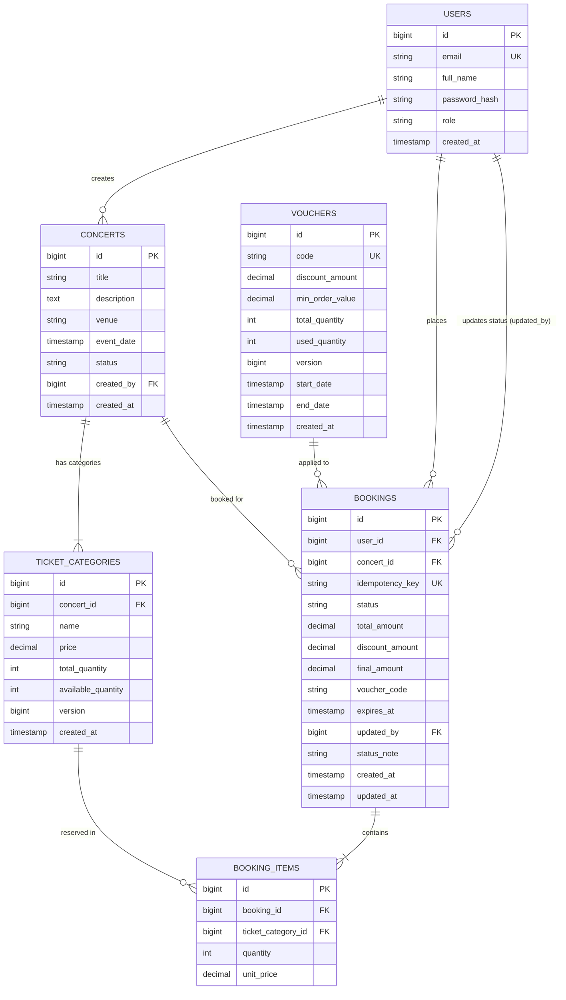

# System Architecture & Technical Design

## 1. High-Level Architecture

The system is designed as a **Modular Monolith** to maximize performance, maintainability, and transaction consistency during high-concurrency Flash Sales.

```text
               +----------------------------------------+
               |   Clients (Mobile / Web / Admin)       |
               +-------------------+--------------------+
                                   |
                                   | HTTPS / REST
                                   v
               +-------------------+--------------------+
               |    Spring Boot Backend Application     |
               |  (Security / JWT / Global Exception)   |
               +-------------------+--------------------+
                                   |
                                   | JDBC / JPA (Pessimistic Locks)
                                   v
                         +------------------+
                         | PostgreSQL DB    |  <-- Enforces Concurrency & State
                         | (Data & Locks)   |
                         +------------------+
                         
   * Note: Redis 7 is provisioned in Docker Compose for future caching & rate-limiting.
```

---

## 1.1 Entity-Relationship Diagram (ERD)



## 2. Flash Sale Concurrency & Race Condition Protection

During peak Flash Sale traffic (300–500 requests/minute), multiple users attempt to purchase limited tickets simultaneously. To guarantee **zero overselling**, the system employs a multi-tiered concurrency strategy:

### A. Ticket Reservation Protection (Pessimistic Locking)
- When a reservation request is received, `BookingService` acquires an explicit **Pessimistic Write Lock** on the target `TicketCategory` row:
  ```sql
  SELECT * FROM ticket_categories WHERE id = :id FOR UPDATE;
  ```
- To prevent **Deadlocks** when a booking contains multiple ticket categories, item IDs are **sorted in ascending order** prior to acquiring locks.

### B. Idempotency Key Guard (Duplicate Retry Protection)
- Every ticket reservation request payload (`CreateBookingRequest`) requires a client-generated `idempotencyKey` JSON field (UUID v4 format).
- `idempotency_key` is backed by a **Database Unique Constraint** (`bookings.idempotency_key UNIQUE`).
- Concurrent retries with the same `idempotencyKey` (e.g. caused by network timeouts or user double-clicking) will either return the existing booking from the initial check, or trigger a `DataIntegrityViolationException` at the database level. `BookingService` gracefully catches this exception and re-queries to return the winning booking without creating duplicate orders or double-deducting stock.

### C. Voucher Abuse & TOCTOU Protection
- **Global Quota:** Voucher rows are locked using `SELECT ... FOR UPDATE` before checking `used_quantity < total_quantity`.
- **Per-User Usage Limit:** Enforced at the database level using a **PostgreSQL Partial Unique Index**:
  ```sql
  CREATE UNIQUE INDEX idx_booking_voucher_per_user_active
  ON bookings (voucher_code, user_id)
  WHERE voucher_code IS NOT NULL
    AND status NOT IN ('CANCELLED', 'EXPIRED', 'FAILED');
  ```
- This prevents Time-of-Check to Time-of-Use (TOCTOU) race conditions when a single user executes simultaneous voucher requests across multiple browser tabs.

---

## 3. Booking Lifecycle State Machine

Bookings follow a strict domain state transition model. Invalid state jumps (e.g., `EXPIRED` -> `CONFIRMED`) are rejected at the service layer via `BookingStatus#canTransitionTo()`.

```text
                           [ Customer Reserves Ticket ]
                                        |
                                        v
                                   +---------+
            +--------------------- | PENDING | ---------------------+
            |                      +----+----+                      |
            | (Timeout 10m)             | (Payment Initiated)       | (Manual Cancel)
            v                           v                           v
      +-----------+           +------------------+           +-----------+
      |  EXPIRED  | <---------| AWAITING_PAYMENT |---------->| CANCELLED |
      +-----------+ (Timeout) +--------+---------+ (Cancel)  +-----------+
            ^                          |                           ^
            |             +------------+------------+              |
            |             | (Success)               | (Fail)       |
            |             v                         v              |
            |       +-----------+             +-----------+        |
            |       | CONFIRMED |             |  FAILED   |        |
            |       +-----+-----+             +-----------+        |
            |             |                                        |
            +-------------+--(Manual Refund/Cancel)----------------+
```
Transition Matrix Summary:

| From Status                 | Allowed Target Statuses                 | Trigger / Responsible Process                   |
|:----------------------------|:----------------------------------------|:------------------------------------------------|
| `PENDING`                   | `AWAITING_PAYMENT, EXPIRED, CANCELLED`  | Customer payment start, Expiry Scheduler, or Manual Cancel   |
| `AWAITING_PAYMENT`          | `CONFIRMED, FAILED, EXPIRED, CANCELLED` | Payment Success, Payment Failure, Timeout, or Operator Override |
| `CONFIRMED`                 | `CANCELLED`                             | Manual Refund / Event Cancellation by Operator   |
| `EXPIRED`                   | `None (Terminal State)`                 | Inventory & Voucher quota released              |
| `CANCELLED`                 | `None (Terminal State)`                 | Inventory & Voucher quota released              |
| `FAILED`                    | `None (Terminal State)`                 | Inventory & Voucher quota released              |


---

## 4. Background Automatic Inventory Release Job

A background scheduled job (`BookingExpiryScheduler`) runs every 30 seconds to clean up abandoned reservations:
1. Queries `PENDING` or `AWAITING_PAYMENT` bookings where `expires_at < NOW()`.
2. Automatically transitions status to `EXPIRED` and increments `available_quantity` back to the ticket category.

## 5. Design Note: Why booking creation logic lives in a separate `BookingTransactionExecutor`

`BookingService.createBooking()` is deliberately NOT `@Transactional`. It
delegates the actual insert logic to `BookingTransactionExecutor` (a
separate Spring bean), and only catches `DataIntegrityViolationException`
around that delegated call — never inside the same transaction that
produced the error.

This is required because PostgreSQL marks an entire transaction as
"aborted" after any failed statement (e.g. a unique constraint violation
on `idempotency_key`). Any further query attempted on that same
transaction/connection — including a fallback lookup — fails with
"current transaction is aborted". Splitting the method across two Spring
beans ensures the failed transaction is fully rolled back and its
connection released *before* the fallback query runs in a fresh
transaction.