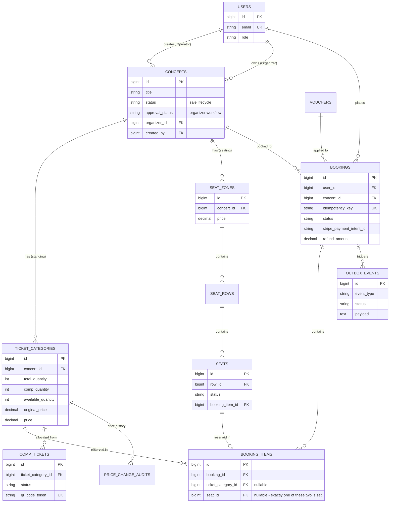

# System Architecture & Technical Design

## 1. High-Level Architecture

The system is a **Modular Monolith**: packages are separated by domain responsibility
(`booking`, `concert`, `seatmap`, `payment`, `pricing`, ...), but the whole thing deploys and
transacts as one Spring Boot application against one PostgreSQL database. This was a deliberate
choice over microservices — the booking flow needs ACID guarantees across tickets, vouchers, and
bookings in a single transaction, which is cheap with one database and expensive (sagas,
distributed locks, eventual consistency) across service boundaries. For the traffic/consistency
profile described in the brief (hundreds of requests/minute against a single DB, not millions
across a federated dataset), a monolith is the right-sized architecture, not a limitation.

```text
                     +------------------------------------------+
                     |     Clients (Web / Mobile / Admin)        |
                     +---------------------+----------------------+
                                           |
                                HTTPS / REST (JWT)
                                           v
        +----------------------------------+----------------------------------+
        |                  Spring Boot Backend Application                     |
        |  Security (JWT, role-based) / Global Exception Handler /            |
        |  AdmissionCheckFilter (waiting room gate)                            |
        +---+----------------+------------------+------------------+----------+
            |                |                  |                  |
     JDBC/JPA (locks)   Redis (cache,      RabbitMQ (async     Stripe API
            |            waiting queue)     notifications)     (payments)
            v                v                  v                  v
     +-------------+  +-------------+  +------------------+  +-------------+
     | PostgreSQL  |  |   Redis     |  |    RabbitMQ      |  |   Stripe    |
     | (data+locks)|  |             |  | (+ Outbox table  |  | (test mode) |
     +-------------+  +-------------+  |   in Postgres)   |  +-------------+
                                        +------------------+

     Prometheus scrapes /actuator/prometheus -> Grafana dashboards
```

---

## 1.1 Entity-Relationship Diagram (ERD)


```mermaid
erDiagram
    USERS ||--o{ CONCERTS : "creates (Operator)"
    USERS ||--o{ CONCERTS : "owns (Organizer)"
    USERS ||--o{ BOOKINGS : "places"
    CONCERTS ||--o{ TICKET_CATEGORIES : "has (standing)"
    CONCERTS ||--o{ SEAT_ZONES : "has (seating)"
    CONCERTS ||--o{ BOOKINGS : "booked for"
    TICKET_CATEGORIES ||--o{ BOOKING_ITEMS : "reserved in"
    SEAT_ZONES ||--o{ SEAT_ROWS : "contains"
    SEAT_ROWS ||--o{ SEATS : "contains"
    SEATS ||--o| BOOKING_ITEMS : "reserved in"
    BOOKINGS ||--o{ BOOKING_ITEMS : "contains"
    VOUCHERS ||--o{ BOOKINGS : "applied to"
    TICKET_CATEGORIES ||--o{ COMP_TICKETS : "allocated from"
    TICKET_CATEGORIES ||--o{ PRICE_CHANGE_AUDITS : "price history"
    BOOKINGS ||--o{ OUTBOX_EVENTS : "triggers"

    USERS {
        bigint id PK
        string email UK
        string role
    }
    CONCERTS {
        bigint id PK
        string title
        string status "sale lifecycle"
        string approval_status "organizer workflow"
        bigint organizer_id FK
        bigint created_by FK
    }
    TICKET_CATEGORIES {
        bigint id PK
        bigint concert_id FK
        int total_quantity
        int comp_quantity
        int available_quantity
        decimal original_price
        decimal price
    }
    SEAT_ZONES {
        bigint id PK
        bigint concert_id FK
        decimal price
    }
    SEATS {
        bigint id PK
        bigint row_id FK
        string status
        bigint booking_item_id FK
    }
    BOOKINGS {
        bigint id PK
        bigint user_id FK
        bigint concert_id FK
        string idempotency_key UK
        string status
        string stripe_payment_intent_id
        decimal refund_amount
    }
    BOOKING_ITEMS {
        bigint id PK
        bigint booking_id FK
        bigint ticket_category_id FK "nullable"
        bigint seat_id FK "nullable - exactly one of these two is set"
    }
    COMP_TICKETS {
        bigint id PK
        bigint ticket_category_id FK
        string status
        string qr_code_token UK
    }
    OUTBOX_EVENTS {
        bigint id PK
        string event_type
        string status
        text payload
    }
```

A `booking_item` belongs to exactly one of `ticket_category` (standing/GA pricing) or `seat`
(assigned seating), enforced by a DB check constraint — never both, never neither. This lets a
single `Booking`/`BookingItem` model, and everything built on top of it (status transitions,
expiry scheduler, voucher application, payment webhooks, refunds), work identically regardless of
whether the underlying inventory is a quantity counter or an individual seat.

---

## 2. Flash Sale Concurrency & Race Condition Protection

This is the core concern the whole design is organized around. Strategy, by layer:

### A. Standing/GA Ticket Reservation (Pessimistic Locking)
`BookingTransactionExecutor` acquires `SELECT ... FOR UPDATE` on the target `ticket_categories`
row before checking/decrementing `available_quantity`. When a booking spans multiple categories,
their IDs are sorted ascending before locking, so two concurrent bookings touching overlapping
categories always acquire locks in the same order — this is what prevents deadlocks, not luck.

### B. Seat Reservation (Two-Phase: Propose, then Lock)
Scanning potentially thousands of seats while holding a row lock would serialize unrelated
customers against each other unnecessarily. Instead, `SeatFinder` searches read-only (no lock) for
candidate seats using a tiered Best-Available-Seat algorithm (contiguous block in one row → split
across two adjacent-priority rows matched by seat number → fewest groups overall). Only the
chosen candidate seats are then locked (`SELECT ... FOR UPDATE`, sorted ascending by id) and
re-verified still `AVAILABLE`. If the race was lost (another request took one of the candidates
between the two phases), the whole search retries up to 5 times with a small backoff, rather than
failing the customer immediately on the first collision.

### C. Idempotency Key Guard (Duplicate Retry Protection)
Every booking-creation request carries a client-generated `idempotencyKey`, enforced unique at the
DB level. On a key collision from a near-simultaneous retry, PostgreSQL rejects the second insert
with `DataIntegrityViolationException` — but catching that and querying for the winning booking
cannot happen in the same transaction (see §5 below); this is why booking creation is split across
two Spring beans.

### D. Voucher Abuse & TOCTOU Protection
- **Global quota:** the voucher row is locked (`SELECT ... FOR UPDATE`) before comparing
  `used_quantity` against `total_quantity`.
- **Per-user limit:** enforced with a PostgreSQL **partial unique index**, not an application-level
  `SELECT COUNT` (which is vulnerable to a classic TOCTOU race across two simultaneous requests
  from the same user, e.g. two browser tabs):
  ```sql
  CREATE UNIQUE INDEX idx_booking_voucher_per_user_active
  ON bookings (voucher_code, user_id)
  WHERE voucher_code IS NOT NULL
    AND status NOT IN ('CANCELLED', 'EXPIRED', 'FAILED');
  ```
  The index self-expires a user's eligibility to reuse a code the moment their prior booking is
  cancelled/expired/failed — no cleanup job needed.

### E. Comp Ticket Issuance
Comp tickets (held-back guest/sponsor tickets) are carved out of `total_quantity` **at category
creation time** via `comp_quantity`; `available_quantity` is initialized as
`total_quantity - comp_quantity`, so the public sale pool and the comp pool can never
cross-contend. Issuing a comp ticket locks the category row only to make the
"issued < comp_quantity" check safe under concurrent issuance — it never touches
`available_quantity`.

### F. Pricing Discounts vs. In-Flight Reservations
`PricingService.applyDiscount()` locks the same `ticket_categories` row
(`findByIdForUpdate`) that `BookingTransactionExecutor` locks when reading the price to charge. No
extra synchronization was needed beyond reusing the existing lock point — Postgres serializes the
two paths automatically, so a reservation in flight always sees either the price before or after a
discount, never a torn/partial state.

### G. Check-in Double-Scan Protection
Unlike ticket reservation (which needs to compare a quantity before deciding), check-in only needs
a single state flip, so it uses a plain atomic `UPDATE ... WHERE status = 'ISSUED'` instead of
`SELECT FOR UPDATE` + `save()`. If two gate scanners hit the same QR code at the same instant
(a shared/photographed ticket), exactly one `UPDATE` affects a row; the other gets 0 rows affected
and is told the ticket was already used.

---

## 3. A Concurrency Bug Found During Development (worth documenting on its own)

Early in building the idempotency-key retry path, catching `DataIntegrityViolationException` and
immediately re-querying for the winning booking **inside the same `@Transactional` method**
intermittently threw an unrelated, generic error instead of returning the existing booking.

**Root cause:** PostgreSQL marks an entire transaction as *aborted* after any statement inside it
fails (e.g., a unique constraint violation). Any further statement sent on that same
transaction/connection — including an innocuous fallback `SELECT` — is rejected outright with
`current transaction is aborted, commands ignored until end of transaction block`. Catching the
exception in Java doesn't un-abort the Postgres transaction underneath it.

**Fix:** `BookingService.createBooking()` is deliberately **not** `@Transactional`. It delegates
the actual insert logic to `BookingTransactionExecutor` — a separate Spring bean, so the call goes
through a real proxy and gets its own transaction — and only catches
`DataIntegrityViolationException` around that delegated call, never inside it. By the time the
catch block runs, Spring's transaction interceptor has already rolled back and released the failed
transaction, so the fallback `findByIdempotencyKey()` query runs in a fresh, uncorrupted
transaction. `saveAndFlush()` is used (not `save()`) so the constraint violation surfaces
immediately inside `executeCreateBooking()`, rather than being deferred to commit time, where it
would arrive as a different exception type (`TransactionSystemException`) that the catch clause
wouldn't match.

This same split-executor-bean pattern is reused for seat booking (`SeatmapService`) for the same
reason.

---

## 4. Booking Lifecycle State Machine

```text
                           [ Customer Reserves Ticket ]
                                        |
                                        v
                                   +---------+
            +--------------------- | PENDING | ---------------------+
            |                      +----+----+                      |
            | (Timeout 10m)             | (Payment Initiated)       | (Manual Cancel)
            v                           v                           v
      +-----------+           +------------------+           +-----------+
      |  EXPIRED  | <---------| AWAITING_PAYMENT |---------->| CANCELLED |
      +-----------+ (Timeout) +--------+---------+ (Cancel)  +-----------+
            ^                          |                           ^
            |             +------------+------------+              |
            |             | (Success)               | (Fail)       |
            |             v                         v              |
            |       +-----------+             +-----------+        |
            |       | CONFIRMED |             |  FAILED   |        |
            |       +-----+-----+             +-----------+        |
            |             |                                        |
            +-------------+--(Refund approved -> webhook)----------+
```

| From | Allowed To | Trigger |
|---|---|---|
| `PENDING` | `AWAITING_PAYMENT`, `EXPIRED`, `CANCELLED` | customer payment start, expiry scheduler, manual cancel |
| `AWAITING_PAYMENT` | `CONFIRMED`, `FAILED`, `EXPIRED`, `CANCELLED` | Stripe webhook (success/fail), timeout, operator override |
| `CONFIRMED` | `CANCELLED` | Stripe `charge.refunded` webhook, following a successful refund request |
| `EXPIRED` / `CANCELLED` / `FAILED` | — | terminal; inventory & voucher quota released on entry |

Leaving `PENDING`/`AWAITING_PAYMENT` to anything other than `CONFIRMED` triggers
`releaseInventory()`, which returns stock to whichever source the booking item came from
(`ticket_categories.available_quantity` or `seats.status = AVAILABLE`), and decrements voucher
`used_quantity` if one was applied.

---

## 5. Concert Approval Workflow (Organizer / Operator)

Separate from the sale lifecycle above. An Operator typically sets up a concert on an organizing
client's behalf; the Organizer must approve it before it can go on sale.

```text
DRAFT --> PENDING_REVIEW --> APPROVED --(Operator publishes)--> [ConcertStatus.ON_SALE]
              ^                  |
              |                  v
              +------------ REJECTED
         (Operator edits, resubmits)
```

Constraints enforced in `ConcertService`:
- `publishConcert()` refuses unless `approvalStatus == APPROVED`.
- `updateConcert()` refuses once `status` is `ON_SALE` or `ENDED` — customers have already made
  purchase decisions based on published information; silent edits afterward would mislead them
  and create legal exposure for the organizer. Only `CANCELLED` (a distinct, explicit action) is
  allowed once live.
- Approve/reject actions verify the caller is the concert's actual `organizer_id` (404, not 403,
  on mismatch — avoids confirming a concert ID exists to someone who doesn't own it).

---

## 6. Dynamic Pricing (Organizer Discounts)

Business rule: an Organizer may discount a `ticket_category`'s price only within 3 days of the
event date, down to a floor of 50% of the category's `original_price` (snapshotted once, at
publish time, and never changed afterward — it exists purely as the discount floor's reference
point). `discounted_price` is tracked separately from `price` so the API can tell a client "this
is currently discounted" without comparing two decimals for equality. Every change is written to
`price_change_audits` (old price, new price, who, when) — required so a pricing dispute has a
paper trail, not just "trust us."

---

## 7. Comp Tickets (Guest / Sponsor Allocations)

Modeled as a pool carved out of `total_quantity` at creation time (`comp_quantity`), issued
individually via `comp_tickets` rows (one per recipient, each with its own QR token), and
completely isolated from the public sale pool — see §2.E above. `comp_quantity` cannot be changed
once a concert is `ON_SALE`, for the same oversell-prevention reason `updateConcert()` is locked
down post-publish. Comp tickets are not emailed automatically; the Operator forwards the issued
QR/details to the Organizer, who distributes them — a deliberately lower-reliability path than
payment confirmation emails, which do go through the Outbox (see §9), because a missed comp ticket
email is a minor inconvenience, not a failed transaction.

---

## 8. Seatmap Engine (Best Available Seat)

Only used for zones flagged as assigned seating; general-admission/standing inventory continues to
use the simpler `ticket_categories` quantity model unchanged — these are two parallel inventory
models under one `Booking`/`BookingItem` schema, not a seatmap bolted awkwardly onto the original
design.

**Why two-phase (propose, then lock)?** Holding a row lock while scanning a zone with thousands of
seats would serialize every customer in that zone against every other, even ones requesting
different seats entirely. `SeatFinder` searches without locking anything; only the specific
candidate seats returned are then locked and double-checked before being handed to the customer
as a `SeatProposal` (2-minute TTL, independent of the 10-minute booking hold that starts once the
customer confirms the proposal into a real `Booking`).

**"Same column" matching:** when a request can't fit in one row, the algorithm looks at two
adjacent-priority rows and matches by `seat_number`. Because rows can have different seat counts
(a non-rectangular venue), only seat numbers that exist as available in *both* rows are considered
— no arithmetic assumes a rectangular grid.

**Row priority** is assigned by the Operator at seat-zone creation (`row_priority`, lower = closer
to stage = preferred first); there is no automatic inference from venue geometry.

Unfilled/expired proposals are released back to `AVAILABLE` by `SeatProposalExpiryScheduler`
(every 30s), mirroring the booking-expiry scheduler's design.

---

## 9. Async Notifications via Transactional Outbox + RabbitMQ

**Problem avoided:** publishing to RabbitMQ directly inside `BookingService.updateStatus()` risks
two failure modes — the DB commits but the publish fails (event silently lost, customer never
emailed), or the publish succeeds but the surrounding DB transaction later rolls back (email sent
for a booking that doesn't exist).

**Design:** when a booking transitions to `CONFIRMED`, an `outbox_events` row is written **in the
same transaction** as the status change. A separate `OutboxPublisherScheduler` (polling every 5s)
reads `PENDING` rows and publishes them to RabbitMQ, marking each `PUBLISHED` on success or
incrementing `retry_count` on failure (capped at 5 attempts before marking `FAILED` for manual
follow-up). If RabbitMQ is down, events simply accumulate as `PENDING` and are picked up
automatically once it recovers — verified manually by stopping the RabbitMQ container mid-test and
confirming the backlog drained once it was restarted, rather than being lost.

`BookingNotificationConsumer` listens on the bound queue and sends the confirmation email.
**Known limitation:** a persistently failing consumer (e.g., bad SMTP config) requeues
indefinitely rather than routing to a Dead Letter Queue — acceptable for this scope, flagged in
ASSUMPTIONS.md as the next hardening step.

---

## 10. Payments (Stripe)

- `PaymentService.createPaymentIntent()` creates a Stripe PaymentIntent for a `PENDING` booking's
  `finalAmount` and transitions it to `AWAITING_PAYMENT`.
- `PaymentWebhookController` verifies the `Stripe-Signature` header via HMAC before processing
  anything — this endpoint is `permitAll()` in Spring Security (Stripe cannot attach our JWTs), so
  the signature check *is* the entire authentication mechanism for this path, not an afterthought.
- **Idempotent webhook handling:** Stripe redelivers events on timeout or non-2xx responses. Each
  event's `(provider, event_id)` is recorded in `processed_webhook_events` (unique constraint)
  before any business logic runs; a redelivery is a no-op, not a double-confirmed booking.
- **Permanent vs. transient failures:** a webhook referencing a PaymentIntent with no matching
  booking (which happens constantly when testing with `stripe trigger`, which fabricates unrelated
  PaymentIntents) is logged and acknowledged with `200`, not `500` — retrying can't make a
  matching booking appear, so treating it as retryable would just produce a retry storm from
  Stripe for days.
- **SDK version mismatch quirk:** `event.getDataObjectDeserializer().getObject()` silently returns
  empty (not an exception) when the Stripe account's API version is newer than the `stripe-java`
  SDK was compiled against. Handlers fall back to `deserializeUnsafe()` in that case, per Stripe's
  own documented guidance — otherwise a webhook could appear to process successfully (`200`) while
  silently doing nothing.

---

## 11. Refunds

Policy, tiered by days until the event (`RefundPolicy`, pure function, no DB/Stripe dependency —
tested exhaustively at every boundary):

| Days until event | Refund |
|---|---|
| ≤ 3 | Not eligible for refund (ticket transfer only — not yet implemented) |
| 4–7 | 50% |
| 8–14 | 70% |
| ≥ 15 | 100% |

`RefundService.requestRefund()` validates eligibility, computes the amount, and calls Stripe's
Refund API — but does **not** itself flip the booking to `CANCELLED`. That happens only when the
`charge.refunded` webhook arrives, for the same reason payment confirmation doesn't optimistically
update on the request thread: Stripe's webhook is the single source of truth for whether money
actually moved. Once confirmed, `BookingService.updateStatus(..., CANCELLED, ...)` runs the same
`releaseInventory()` path used by expiry/manual cancellation — refunds didn't need their own
inventory-release logic because the state machine already had a correct, general-purpose one.

---

## 12. Virtual Waiting Room

Built on Redis, reusing the cache infrastructure already present rather than introducing a new
dependency. A Sorted Set (`ZADD`, score = join timestamp) gives O(log n) position lookups
(`ZRANK`) and O(log n + batch) admission (`ZPOPMIN`) without polling the database.

- `WaitingRoomAdmissionScheduler` admits a configurable batch size every few seconds for each
  `ON_SALE` concert. The batch size is set based on the throughput ceiling measured in load
  testing (§ below / `docs/PERFORMANCE.md`), not guessed.
- Admitted users receive a short-lived JWT `admissionToken`, distinct from the auth JWT (separate
  claim type, separate TTL).
- `AdmissionCheckFilter` gates only the two endpoints that actually contend for locks under flash
  sale load (`POST /bookings`, `POST /seatmap/propose`) — browsing, login, and other low-cost
  reads are intentionally not gated, since gating them would add latency without reducing DB
  contention.

---

## 13. Observability

- Micrometer exposes `/actuator/prometheus`; Prometheus scrapes it; Grafana visualizes it
  (imported community dashboards for JVM/HTTP/HikariCP, plus a custom panel for business metrics).
- Custom metrics (`BookingMetrics`): `booking.creation.success`,
  `booking.creation.failed.insufficient_stock` (counted separately from genuine errors — a 409
  from a sold-out category is the *system working correctly*, not a failure), and
  `booking.creation.duration` (histogram, includes lock wait time).
- See `docs/PERFORMANCE.md` for the k6 methodology, the HikariCP pool-size bottleneck found and
  fixed, and the measured throughput/latency at increasing load.